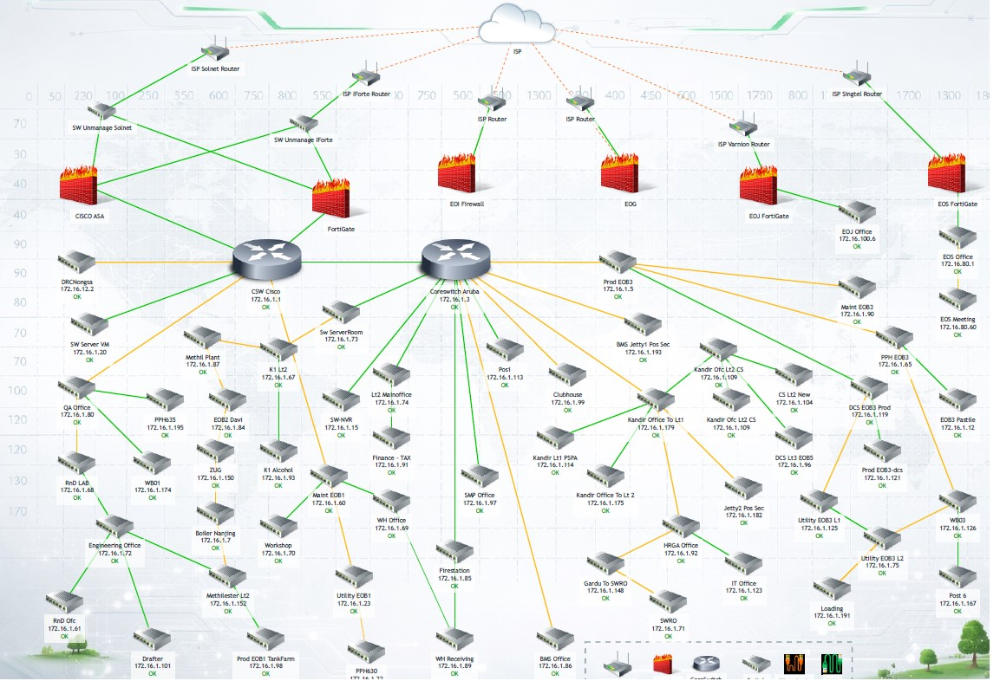

# Dashboard Network Topology

## System Operation Control Zabbix Ecogreen

---

## 1. Latar Belakang
Dalam pengelolaan jaringan, pemantauan perangkat dan trafik sangat penting untuk menjaga kestabilan layanan.  
Sebelum adanya dashboard monitoring, proses pengecekan kondisi jaringan dilakukan secara manual sehingga memerlukan waktu lebih lama saat terjadi gangguan.

Project ini dibuat untuk membangun dashboard **Network Topology** menggunakan **Zabbix** agar administrator dapat memantau kondisi perangkat jaringan secara terpusat, cepat, dan efisien.

---

## 2. Permasalahan
Beberapa permasalahan yang dihadapi sebelum implementasi dashboard ini antara lain:

- Sulit mengetahui perangkat yang mengalami gangguan secara cepat
- Monitoring trafik jaringan masih dilakukan manual
- Tidak ada tampilan terpusat untuk memantau seluruh perangkat
- Proses troubleshooting memerlukan waktu lebih lama
- Sulit melakukan analisa historis terhadap performa jaringan

---

## 3. Tujuan Project
Tujuan dari project ini adalah:

- Membangun dashboard monitoring topology jaringan
- Menampilkan status perangkat jaringan secara real-time
- Mempermudah pemantauan trafik jaringan
- Mempercepat proses identifikasi gangguan
- Menyediakan tampilan monitoring yang terpusat dan mudah dipahami

---

## 4. Ruang Lingkup
Project ini mencakup:

- Monitoring perangkat jaringan yang terhubung
- Visualisasi topologi jaringan
- Monitoring status host up/down
- Monitoring trafik interface
- Monitoring performa perangkat melalui Zabbix

Project ini tidak mencakup konfigurasi ulang perangkat jaringan secara otomatis.

---

## 5. Analisa Kebutuhan

### Kebutuhan Perangkat
Perangkat yang digunakan dalam project ini antara lain:

- Server monitoring Zabbix
- Switch jaringan
- Router
- Access Point
- Perangkat client atau node jaringan

### Kebutuhan Software
Software yang digunakan:

- Zabbix Server
- Web interface Zabbix
- Sistem operasi Linux
- SNMP untuk monitoring perangkat
- Web browser untuk akses dashboard

### Kebutuhan Jaringan
Agar implementasi berjalan dengan baik, diperlukan:

- Koneksi jaringan antar perangkat stabil
- IP address perangkat diketahui
- SNMP aktif pada perangkat yang akan dimonitor
- Port monitoring terbuka dan dapat diakses dari server Zabbix

---

## 6. Desain / Topologi Jaringan
Topologi jaringan ditampilkan dalam bentuk dashboard untuk mempermudah administrator dalam melihat hubungan antar perangkat.

---

## 7. Implementasi

### 7.1 Persiapan
Tahapan awal implementasi meliputi:

- Menyiapkan server Zabbix
- Mengidentifikasi seluruh perangkat jaringan
- Menentukan IP address perangkat
- Memastikan SNMP aktif
- Melakukan uji konektivitas antar perangkat

### 7.2 Konfigurasi Monitoring
Konfigurasi dilakukan dengan langkah berikut:

- Menambahkan host ke Zabbix
- Mengatur interface monitoring
- Menambahkan template sesuai jenis perangkat
- Membuat item monitoring untuk status dan trafik
- Membuat trigger untuk notifikasi gangguan

### 7.3 Pembuatan Dashboard
Dashboard dibuat untuk menampilkan informasi berikut:

- Status perangkat online/offline
- Hubungan antar perangkat dalam topologi
- Trafik interface
- Kondisi host yang sedang bermasalah
- Informasi monitoring secara visual dan terpusat

---

## 8. Hasil Implementasi
Setelah implementasi dilakukan, dashboard berhasil menampilkan informasi jaringan secara lebih jelas dan terpusat.

Beberapa hasil yang diperoleh:

- Administrator dapat melihat perangkat jaringan dalam satu tampilan
- Gangguan perangkat lebih cepat terdeteksi
- Monitoring trafik menjadi lebih mudah
- Informasi kondisi jaringan dapat dianalisa secara real-time
- Proses troubleshooting menjadi lebih efisien

---

## 9. Analisa Hasil
Dari hasil implementasi dashboard topology ini, dapat disimpulkan bahwa penggunaan Zabbix memberikan manfaat besar dalam kegiatan operasional jaringan.

### Keunggulan yang diperoleh:
- Monitoring lebih terpusat
- Tampilan lebih mudah dipahami
- Mempercepat respon terhadap gangguan
- Membantu analisa performa jaringan
- Mempermudah pengawasan perangkat secara berkala

### Kendala yang ditemukan:
- Beberapa perangkat membutuhkan konfigurasi SNMP tambahan
- Template monitoring harus disesuaikan dengan jenis perangkat
- Tampilan topologi perlu pembaruan jika ada perubahan jaringan

---

## 10. Kesimpulan
Project **Dashboard Network Topology** berhasil diimplementasikan menggunakan **Zabbix** sebagai sistem monitoring utama.  
Dengan adanya dashboard ini, proses pemantauan perangkat jaringan menjadi lebih cepat, terpusat, dan efisien.

Dashboard ini membantu administrator dalam:

- Memantau kondisi perangkat jaringan
- Melihat struktur topologi secara visual
- Mengetahui gangguan lebih awal
- Meningkatkan efisiensi operasional jaringan

---

## 11. Saran Pengembangan
Untuk pengembangan selanjutnya, project ini dapat ditingkatkan dengan:

- Menambahkan notifikasi otomatis melalui Email atau Telegram
- Menambahkan monitoring bandwidth yang lebih detail
- Menambahkan laporan historis performa jaringan
- Mengintegrasikan monitoring WiFi dan VLAN
- Menambahkan dashboard khusus untuk perangkat kritis

---

## 12. Dokumentasi
Dokumentasi utama project ditampilkan melalui dashboard berikut:

---

## 13. Penutup
Dashboard monitoring topology jaringan merupakan solusi yang efektif untuk membantu tim IT dalam menjaga stabilitas dan performa jaringan.  
Dengan implementasi yang tepat, sistem monitoring ini dapat menjadi dasar pengembangan network operation center yang lebih lengkap di masa mendatang.
